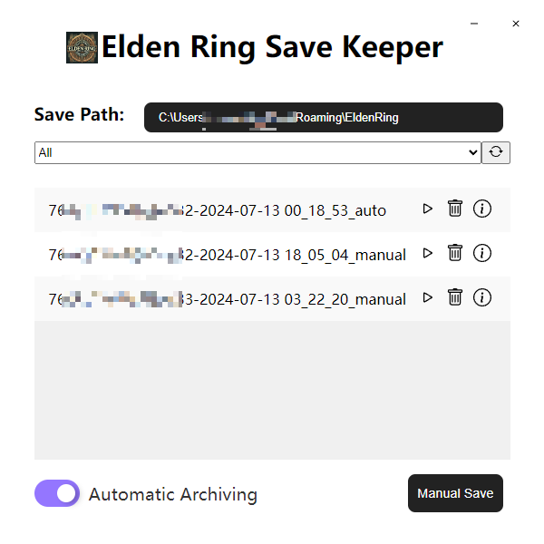
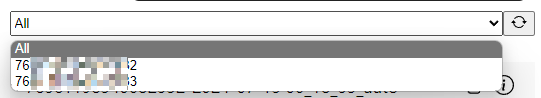

# Elden Ring Save Keeper

[English](README.md) | [中文](README_zh.md)

[Download](https://github.com/0Chencc/EldenRingSaveKeeper/releases/latest)

> Save management system, support for automatic save/manual save and reading of Elden Ring. It will also support archive editing in the future: allowing importing external archives, exporting archives, and viewing archived character data.

## Future Plans
The current future plans are:

1. add import other user save, export save function
2. add save analysis function

## Functions
### 0x00 Automatically saves the archive of the most recently used Steam account when the program is first started.

### 0x01 In cases where there are multiple Steam accounts on the computer that have used Elden Ring, and they all use this tool to back up their data, it will automatically separate the different accounts.

### 0x02 When the restore button is pressed, a second confirmation will be made and the file will be read. Please choose carefully.

### 0x03 When the Delete button is pressed, it will also be confirmed twice, and when it is confirmed, it will delete the archive that was backed up in this tool (and not the official archive directory of Elden Ring). Again, please choose carefully.

