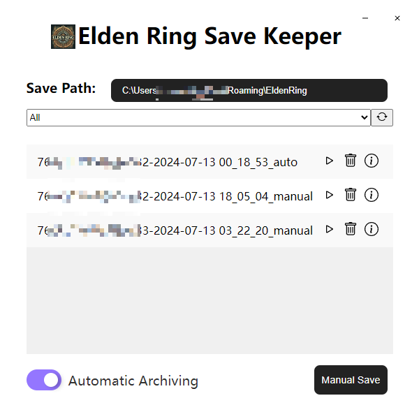
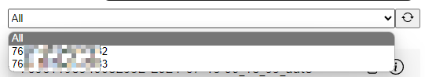
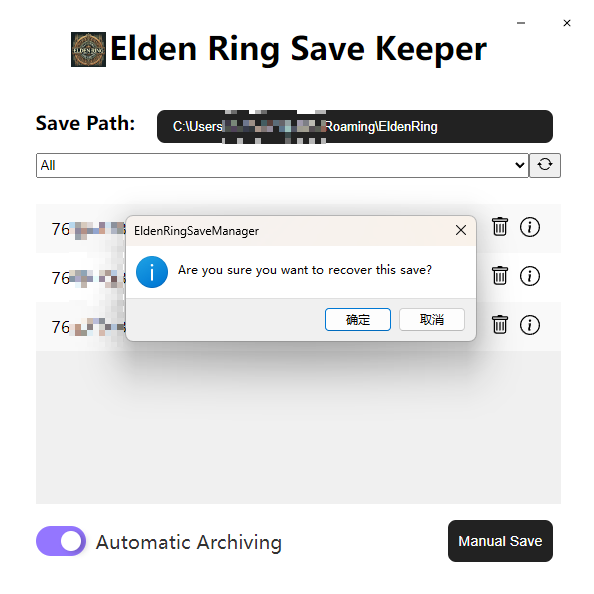
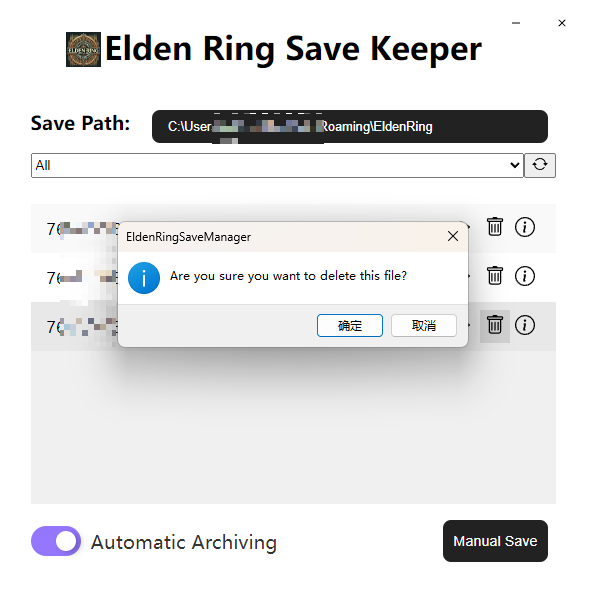

# 艾尔登法环存档管理(Elden Ring Save Keeper)

[English](README.md) | [中文](README_zh.md)

[下载](https://github.com/0Chencc/EldenRingSaveKeeper/releases/latest)

> 存档管理系统，支持对艾尔登法环进行自动存档/手动存档，读档功能。同时在未来将支持存档编辑功能：允许导入外部存档，导出存档，查看存档角色数据

## 未来规划
目前未来的规划是：

1. 添加导入存档，导出存档功能
2. 新增存档分析功能

## 功能

### 0X00 在程序第一次启动时，会自动保存最近使用的Steam账号的存档。

### 0X01 在电脑存在多个Steam账号使用过艾尔登法环的情况，且都使用本工具进行备份数据时，会自动将不同账号分开。

### 0x02 当按下恢复按钮后，会进行二次确认，会进行读档。请慎重选择。

### 0x03 当按下删除按钮后，同样会进行二次确认，确认之后会删除在本工具备份的存档(而非艾尔登法环官方存档目录)。同样请慎重选择。

